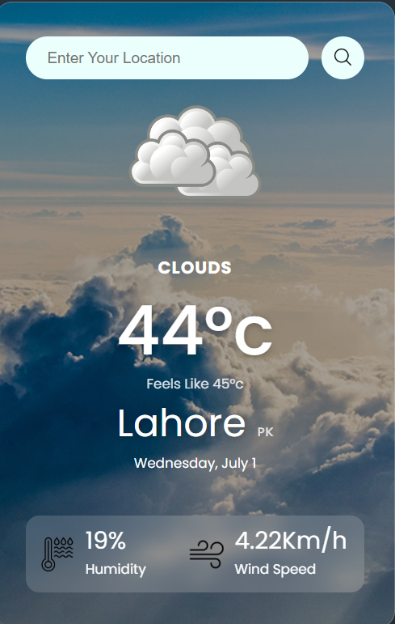

# 🌤️ Weather App

A clean, minimal weather app built with HTML, CSS, and JavaScript — powered by the OpenWeatherMap API. Search any city and get real-time weather data instantly.

🔗 **Live Demo:** [https://weather-app-one-lovat-61.vercel.app/](https://weather-app-one-lovat-61.vercel.app/)

---

## 📸 Screenshots

### App View

---

## ✨ Features

- 🔍 **City Search** — Enter any city name to get current weather
- 🌡️ **Temperature** — Displays current temperature in Celsius
- 🤔 **Feels Like** — Shows what the temperature actually feels like
- ☁️ **Weather Condition** — Displays weather type (Clouds, Rain, Clear, etc.)
- 💧 **Humidity** — Shows current humidity percentage
- 💨 **Wind Speed** — Displays wind speed in Km/h
- 📅 **Date** — Shows current date
- 🌍 **Country Code** — Displays country along with city name
- 🖼️ **Dynamic Background** — Background changes according to weather condition

---

## 🛠️ Tech Stack

| Technology           | Usage                  |
| -------------------- | ---------------------- |
| HTML5                | Structure              |
| CSS3                 | Styling & Animations   |
| JavaScript (Vanilla) | Logic & API calls      |
| OpenWeatherMap API   | Real-time weather data |
| Netlify              | Deployment             |

---

## 📁 Project Structure

    weather-app/
    │
    ├── index.html
    ├── style.css
    └── script.js
    ├── app.png
    ├── images

---

## 🚀 How It Works

1. User enters a city name in the search bar
2. JavaScript fetches real-time data from OpenWeatherMap API
3. Temperature, condition, humidity and wind speed are displayed
4. Weather icon updates based on current condition
5. Background changes dynamically to match the weather

---

## 🔑 API Used

**OpenWeatherMap**

- Free API — [openweathermap.org](https://openweathermap.org/api)
- Endpoint used:
  - `/data/2.5/weather` — Current weather by city name

---

## 👨‍💻 Author

**Muhammad Saad**

- GitHub: [@MuhammadSaad-55](https://github.com/MuhammadSaad-55)

---

⭐ **If you like this project, give it a star!**
